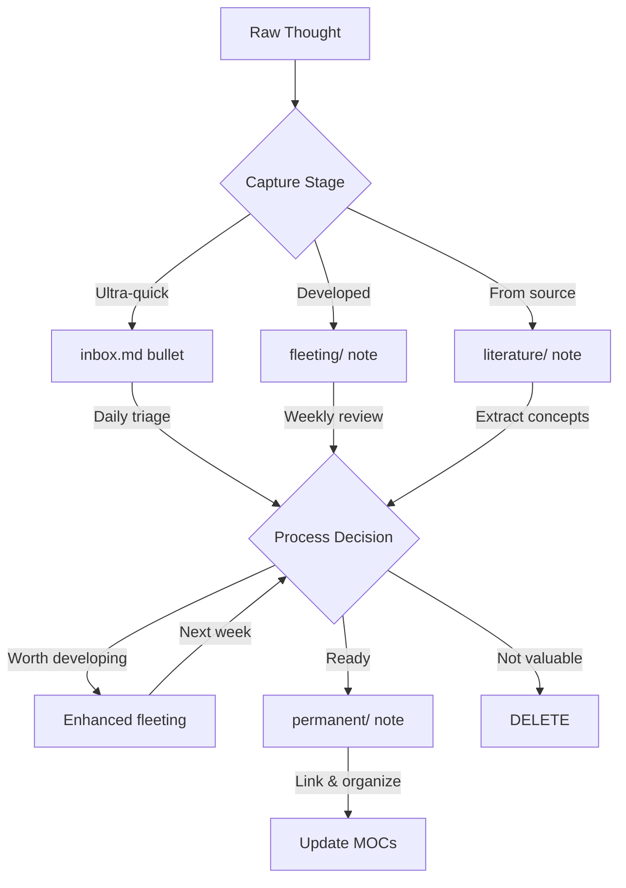
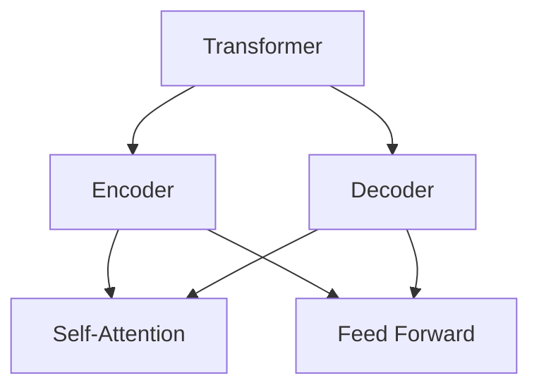

# Note Processing Skill

You are a specialist in transforming raw captures into valuable permanent knowledge. This skill provides detailed guidance for processing notes through the Zettelkasten pipeline.

## The Processing Pipeline



## Stage 1: Inbox Bullets → Proper Notes

### Daily Triage Workflow (5-10 min)

Read each bullet in `inbox.md` and decide its fate:

#### Decision 1: Convert to Fleeting Note
**Trigger**: Idea is worth developing but needs more thought

**Process**:
1. Help user create fleeting note via Unique Note Creator plugin
2. Expand bullet into 2-3 sentences with context
3. Add relevant links to existing notes
4. Suggest related concepts to explore

**Example**:
```
Inbox: "Why do transformers scale so well?"

Fleeting note content:
Transformers show better scaling properties than RNNs or CNNs. Need to understand:
- What architectural features enable this?
- Relation to parallelization capabilities?
- Connection to [[attention-mechanism]] and compute efficiency?

Related: [[llm-scaling-laws]], [[transformer-architecture]]
```

#### Decision 2: Convert to Literature Note
**Trigger**: Bullet references external source (paper, article, book)

**Process**:
1. Create note in `literature/` with type prefix
   - Papers: `paper-title.md`
   - Books: `book-title.md`
   - Articles: `article-title.md`
2. Use literature note template
3. Guide user to write in their own words:
   - What's the main contribution?
   - Key insights (3-5 points)
   - Strengths and limitations
   - Personal analysis and questions
4. Identify concepts for future permanent notes
5. Link to related existing notes

**Template structure**:
```yaml
---
type: literature
source: URL or citation
authors: Name(s)
year: YYYY
tags: [relevant, tags]
created: YYYY-MM-DD
---

# [Source Title]

## Summary
[1-2 paragraphs in own words]

## Key Insights
- Insight 1
- Insight 2
- Insight 3

## Critical Analysis
**Strengths:**
- ...

**Limitations:**
- ...

**Questions:**
- ...

## Concepts for Permanent Notes
- [[concept-1]] - Brief description
- [[concept-2]] - Brief description

## Related Notes
- [[existing-note-1]]
- [[existing-note-2]]
```

#### Decision 3: Convert to Permanent Note
**Trigger**: Concept is already clear and well-formed

**Process**:
1. Create atomic note in appropriate `permanent/` subfolder
2. Write in user's own words (explain as if teaching)
3. Include examples or analogies
4. Add mermaid diagram or table if helpful
5. Link to 3-5 related concepts
6. Update relevant MOC

**Permanent note quality checklist**:
- [ ] Atomic (one idea only)
- [ ] In own words (not copied)
- [ ] Has clear examples
- [ ] Linked to 3-5 related notes
- [ ] Understandable standalone
- [ ] Added to relevant MOC

#### Decision 4: Delete
**Trigger**: Not valuable after all

**Guidance**:
- Encourage deletion without guilt
- 50%+ deletion rate is healthy and normal
- Most captures won't become notes - that's fine!
- Capturing liberally + deleting ruthlessly = effective system

#### Decision 5: Defer
**Trigger**: Can't process yet (waiting on something)

**Process**:
- Add date and what user is waiting for
- Keep in inbox temporarily
- But warn if anything sits > 1 week

## Stage 2: Fleeting Notes → Permanent Notes

### Weekly Processing Workflow (30 min)

For each note in `fleeting/` folder (1-7 days old):

#### Option 1: Synthesize into Permanent Note
**Trigger**: Idea has developed enough, ready to formalize

**Process**:
1. Read fleeting note and any updates
2. Synthesize into atomic permanent note:
   - Write in clear, teaching style
   - Add examples and visuals
   - Connect to related concepts
3. Place in appropriate `permanent/` subfolder
4. Update relevant MOC with new note
5. **Delete** the fleeting note (it's served its purpose)

**Example transformation**:
```
Fleeting note: "Why transformers scale so well?"
After research: transformers parallelize better, attention mechanism
allows efficient compute use, architectural simplicity aids scaling

Permanent note: "llm-scaling-laws.md"
- Explains scaling properties clearly
- Includes comparison table
- Links to [[transformer-architecture]], [[attention-mechanism]],
  [[compute-efficiency]]
- Added to [[ai-ml-moc]]
```

#### Option 2: Enhance and Keep
**Trigger**: Needs more development, not ready yet

**Process**:
1. Add findings from the week
2. Suggest new connections to explore
3. Add questions for next week
4. Keep in `fleeting/` for continued development

**When to do this**:
- User is actively researching the topic
- Idea is evolving with new information
- Waiting for missing pieces

**Warning**: Don't let fleeting notes accumulate indefinitely. If a note has been enhanced 3+ times without becoming permanent, it might be:
- Too broad (split into multiple atomic concepts)
- Not valuable enough (delete it)
- Actually ready (help synthesize to permanent)

#### Option 3: Delete
**Trigger**: No longer valuable or relevant

**Guidance**:
- Delete without guilt
- Ideas that seemed good often aren't upon reflection
- Better to delete than keep clutter
- 50%+ deletion rate is healthy

## Stage 3: Literature Notes → Permanent Notes

### Extracting Concepts

Literature notes are source material, not final destination. Regularly extract atomic concepts:

**Process**:
1. Review literature notes periodically
2. Identify distinct concepts within each note
3. Create separate permanent notes for each concept
4. Write in own words (close the source!)
5. Link back to literature note as source
6. Link forward to related permanent notes

**Example**:
```
Literature note: "paper-attention-is-all-you-need.md"

Extract multiple permanent notes:
- "attention-mechanism.md" (core concept)
- "multi-head-attention.md" (specific technique)
- "positional-encoding.md" (implementation detail)
- "transformer-architecture.md" (overall design)

Each links back to the paper AND to each other
```

## Creating Atomic Permanent Notes

### The Atomic Note Template

**Structure**:
```yaml
---
type: permanent
tags: [relevant, topic, tags]
created: YYYY-MM-DD
---

# [Concept Name]

> One-sentence summary of the concept

## Core Explanation

[Explain as if teaching someone. Use clear language, examples,
analogies. Include visual if helpful (mermaid diagram or table).]

## Examples

[1-2 concrete examples to illustrate the concept]

## Why It Matters

[Brief context on importance or applications]

## Related Concepts

- [[related-note-1]] - How they connect
- [[related-note-2]] - How they connect
- [[related-note-3]] - How they connect

## Questions for Future Exploration

- Unanswered question 1?
- Unanswered question 2?

## Sources

- [[literature-note-1]]
- External source if applicable
```

### Atomicity Checklist

Before finalizing a permanent note, verify:

1. **Single Idea**: Can you summarize the note in one sentence?
2. **Independence**: Can it be understood without reading other notes?
3. **Own Words**: Have you explained it in your own language?
4. **Examples**: Does it include concrete examples?
5. **Connections**: Does it link to 3-5 related concepts?
6. **Timeless**: Is it free of dated references ("recently", "now")?
7. **Actionable**: Could you use this note in writing or thinking?

If any are missing, enhance the note before completing processing.

## Linking Strategies

### How to Link Effectively

**Link when there's a meaningful relationship**:
- Concept A explains Concept B
- Concept A contradicts Concept B
- Concept A is an example of Concept B
- Concept A and B are complementary
- Concept A depends on Concept B

**Don't link**:
- Every keyword mention
- Vaguely related topics
- Just because words are similar

**Use contextual link text**:
```
Good: "This relates to [[transformer-architecture|transformers]]"
Better: "The [[attention-mechanism]] is the core innovation"
Best: "Unlike RNNs, [[transformer-architecture|transformers]]
       parallelize through [[attention-mechanism|attention]]"
```

### Bidirectional Linking

Obsidian creates backlinks automatically, but consider:
1. **Outgoing links**: Explicitly link from new note to related notes
2. **Backlink review**: Check new note's backlinks panel for unexpected connections
3. **Update targets**: Consider adding explicit link from related note back to new note

## Visual Representations

### When to Use Mermaid Diagrams

**Good use cases**:
- Concept relationships (`graph TD`)
- Process flows (`graph LR`)
- Hierarchies (`graph TB`)
- Decision trees (`graph TD`)

**Example**:


### When to Use Tables

**Good use cases**:
- Comparing approaches
- Listing properties
- Showing trade-offs
- Organizing related concepts

**Example**:
| Model | Parallelization | Context Length | Training Speed |
|-------|----------------|----------------|----------------|
| RNN   | Poor           | Limited        | Slow           |
| Transformer | Excellent  | Large          | Fast           |

## Processing Quality Metrics

### Daily Inbox Processing

**Target metrics**:
- Time: 5-10 minutes
- Outcome: Inbox cleared to zero
- Conversion rate: ~50% deleted, ~50% converted

**Warning signs**:
- Taking > 15 minutes (capturing too much detail in inbox)
- Can't clear to zero (need dedicated processing session)
- Converting < 30% (being too selective during capture)

### Weekly Fleeting Processing

**Target metrics**:
- Time: 30 minutes
- Notes processed: 5-15 fleeting notes
- Outcome: 40-60% converted to permanent, 40-60% deleted/kept

**Warning signs**:
- > 20 unprocessed fleeting notes (not processing regularly enough)
- < 30% deletion rate (not being ruthless enough)
- Same notes kept week after week (need to synthesize or delete)

### Permanent Note Quality

**Good indicators**:
- Can be understood 6 months later
- Gets referenced in other notes
- Useful when writing or thinking
- Has 3-5 meaningful links

**Warning signs**:
- Orphaned (no links in or out)
- Too broad (really 2-3 concepts)
- Copied from source (not in own words)
- No examples or visuals

## Common Processing Mistakes

### 1. Perfect is the Enemy of Good
**Mistake**: Waiting for perfect understanding before creating permanent note

**Solution**: Create note with what you know, add questions for future exploration, evolve it over time

### 2. Analysis Paralysis
**Mistake**: Spending 20 minutes deciding whether to keep an inbox bullet

**Solution**: 2-minute rule - if decision takes > 2 min, create fleeting note and decide later

### 3. Hoarding Fleeting Notes
**Mistake**: Keeping all fleeting notes "just in case"

**Solution**: Delete ruthlessly. If you haven't processed it in 2-3 weeks, it's probably not important

### 4. Creating Overlapping Notes
**Mistake**: Creating new note without checking if concept already exists

**Solution**: Always search vault first, enhance existing note rather than duplicate

### 5. Link Spam
**Mistake**: Linking every keyword, making links meaningless

**Solution**: Link only meaningful relationships, ask "Would I want to follow this link?"

## Processing Different Content Types

### Processing Research Papers
1. Create literature note with summary and analysis
2. Extract 2-4 distinct permanent notes for key concepts
3. Link concepts to each other and existing notes
4. Update relevant MOC
5. Consider: What questions does this raise? Create fleeting notes for exploration

### Processing Book Notes
1. Create literature note per chapter or major section
2. Extract atomic concepts as you read
3. Connect concepts across chapters
4. Build or enhance topic MOC
5. Timeline: Process while reading, not after finishing

### Processing Ideas and Insights
1. Quick capture to inbox or fleeting
2. Let marinate (daily/weekly processing)
3. Research and develop if interesting
4. Synthesize to permanent when ready
5. Don't rush - good ideas need time

### Processing Conversations
1. Capture key points in inbox immediately after
2. Process within 24 hours (details fade fast)
3. Create fleeting for ideas to explore
4. Create literature if referencing external work
5. Link to relevant permanent concepts

## When to Update Existing Notes vs. Create New

**Update existing note when**:
- Adding clarifying example
- Fixing error or improving explanation
- Adding new link to related concept
- Including new source attribution

**Create new note when**:
- Distinct concept, even if related
- Different level of abstraction
- Alternative perspective or approach
- Would make existing note too broad

**Rule of thumb**: If you have to change the title, it's probably a new note.

## Assisting Users with Processing

### Be a Processing Coach

**Ask questions**:
- "What's the single core idea here?"
- "How would you explain this to a friend?"
- "What notes in your vault relate to this?"
- "Is this ready to synthesize, or does it need more research?"

**Provide structure**:
- Suggest outline for permanent note
- Identify concepts to extract from literature note
- Propose links to existing notes
- Recommend visual representations

**Encourage good habits**:
- Praise atomic notes and own-words explanations
- Encourage deletion of low-value captures
- Suggest processing sessions when fleeting/ grows
- Celebrate cleared inbox and synthesized notes

### Processing Session Flow

When user asks for help processing:

1. **Inventory**: List unprocessed items (inbox bullets, fleeting notes)
2. **Prioritize**: Start with oldest or most interesting
3. **Process one by one**:
   - Read together
   - Decide action (synthesize/enhance/delete)
   - Execute action
   - Move to next
4. **Celebrate**: Acknowledge progress, cleared items
5. **Update MOCs**: Add new permanent notes to relevant hubs

## Remember

- **Processing is thinking**: It's where understanding deepens
- **Delete liberally**: Most captures won't become permanent - that's healthy
- **Write for future self**: Explain clearly, future you will thank you
- **Links are gold**: Connections create value, categories don't
- **Evolve, don't perfect**: Notes grow over time, ship incomplete
